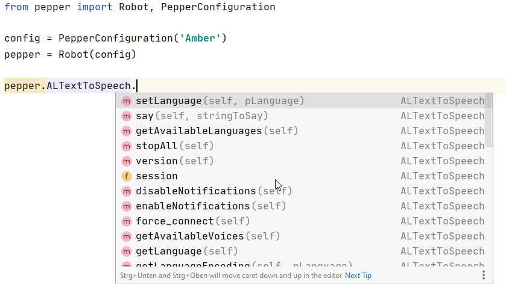

# Python NAOqi Wrapper

This is a python wrapper for NAOqi that makes programming easier. It's a set of generated classes from the C++ SDK header files with docstrings.

Using this module allows you to benefit from **autocompletion** and **docstrings** in your favorite IDE.


## Installation

1. Install pynaoqi (see [here](http://doc.aldebaran.com/2-5/dev/python/install_guide.html))

1. Clone this repository and install the package locally by running:

```python
python setup.py install [--user]
```

## Usage

You can choose one of the HSLU peppers peppers "Amber", "Pale" or "Porter":

```python
from pepper import Robot, PepperConfiguration

robot = Robot(PepperConfiguration("Amber"))
```


In your IDE, the autocompletion should work now:




**Test**

If you are in the same wireless network as Amber, run the `testRun.py` (or modify `testRun.py` to work with another robot).


**Note:**

The code is based on pynaoqi_mate
https://github.com/uts-magic-lab/pynaoqi_mate
and was adapted to work with pynaoqi 2.5 and our three pepper robots "amber", "pale" and "porter".

